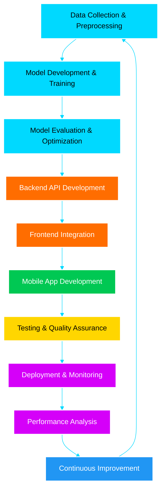

<div align="center">
  
</div>

<div align="center">


</div>

<div align="center">
  
[](https://linkedin.com/in/abderrahmane-houri)
[](mailto:abderrahmane.houri@ensia.edu.dz)
[](https://github.com/Abderrahamane)
[](https://abderrahamane.github.io/Portfolio/)

</div>


## About Me

```python
class AbderrahmaneHouri:
    def __init__(self):
        self.name = "Abderrahmane Houri"
        self.role = "Full Stack AI Developer"
        self.education = "Computer Science Student @ ENSIA"
        self.location = "Algiers, Algeria 🇩🇿"
        self.interests = ["AI/ML", "Web Development", "Mobile Apps", "Cloud Computing"]
        
    def current_focus(self):
        return [
            "Building AI-powered applications",
            "Exploring Large Language Models",
            "Creating full-stack solutions",
            "Contributing to open source"
        ]
    
    def say_hi(self):
        print("Thanks for dropping by! Let's build something amazing together")

me = AbderrahmaneHouri()
me.say_hi()
```

 **Computer Science Student** passionate about leveraging AI and modern technologies to solve real-world problems. I specialize in building intelligent, scalable applications that bridge the gap between machine learning and practical user experiences.

 **Currently:** Diving deep into AI/ML, building full-stack applications, and exploring the latest in cloud technologies.

 **Learning:** Advanced AI architectures, MLOps, Microservices, and Cloud-Native development.

 **Fun fact:** I believe the best code is the code that makes a difference!


##  Tech Stack & Skills

<div align="center">

### ML & DL

<table>
<tr>
<td align="center" width="10%">

<br><b>Python</b>
<br><code>Legendary</code>
</td>
<td align="center" width="10%">

<br><b>TensorFlow</b>
<br><code>Seeker</code>
</td>
<td align="center" width="10%">

<br><b>PyTorch</b>
<br><code>Seeker</code>
</td>
<td align="center" width="10%">

<br><b>Scikit Learn</b>
<br><code>Good</code>
</td>
<td align="center" width="10%">

<br><b>Pandas</b>
<br><code>Epic</code>
</td>
<td align="center" width="10%">

<br><b>NumPy</b>
<br><code>Epic</code>
</td>
<td align="center" width="10%">

<br><b>OpenAI</b>
<br><code>Seeker</code>
</td>
</tr>
</table>

### Frontend Arsenal

<table>
<tr>
<td align="center" width="12.5%">

<br><b>React</b>
<br><code>Seeker</code>
</td>
<td align="center" width="12.5%">

<br><b>Next.js</b>
<br><code>beginner</code>
</td>
<td align="center" width="12.5%">

<br><b>TypeScript</b>
<br><code>Seeker</code>
</td>
<td align="center" width="12.5%">

<br><b>JavaScript</b>
<br><code>Legendary</code>
</td>
<td align="center" width="12.5%">

<br><b>HTML5</b>
<br><code>Epic</code>
</td>
<td align="center" width="12.5%">

<br><b>CSS3</b>
<br><code>Epic</code>
</td>
<td align="center" width="12.5%">

<br><b>Tailwind CSS</b>
<br><code>Seeker</code>
</td>
</tr>
</table>

### Backend Arsenal

<table>
<tr>
<td align="center" width="14.28%">

<br><b>Node.js</b>
<br><code>Epic</code>
</td>
<td align="center" width="14.28%">

<br><b>Express.js</b>
<br><code>Epic</code>
</td>
<td align="center" width="14.28%">

<br><b>Django</b>
<br><code>Seeker</code>
</td>
<td align="center" width="14.28%">

<br><b>FastAPI</b>
<br><code>Good</code>
</td>
<td align="center" width="14.28%">

<br><b>Flask</b>
<br><code>Beginner</code>
</td>
</tr>
</table>

### Mobile Arsenal

<table>
<tr>
<td align="center" width="25%">

<br><b>Flutter</b>
<br><code>Epic</code>
</td>
<td align="center" width="25%">

<br><b>Dart</b>
<br><code>Epic</code>
</td>
<td align="center" width="25%">

<br><b>React Native</b>
<br><code>Seeker</code>
</td>
</tr>
</table>

### Database Arsenal

<table>
<tr>
<td align="center" width="20%">

<br><b>MongoDB</b>
<br><code>Epic</code>
</td>
<td align="center" width="20%">

<br><b>MySQL</b>
<br><code>Good</code>
</td>
<td align="center" width="20%">

<br><b>Firebase</b>
<br><code>Epic</code>
</td>
<td align="center" width="20%">

<br><b>Redis</b>
<br><code>Beginner</code>
</td>
</tr>
</table>

### Cloud & DevOps Arsenal

<table>
<tr>
<td align="center" width="16.66%">

<br><b>Docker</b>
<br><code>Beginner</code>
</td>
<td align="center" width="16.66%">

<br><b>AWS</b>
<br><code>Beginner</code>
</td>
<td align="center" width="16.66%">

<br><b>Google Cloud</b>
<br><code>Seeker</code>
</td>
<td align="center" width="16.66%">

<br><b>Git</b>
<br><code>Legendary</code>
</td>
<td align="center" width="16.66%">

<br><b>GitHub Actions</b>
<br><code>Legendary</code>
</td>
</tr>
</table>

### Tools & Platforms Arsenal

<table>
<tr>
<td align="center" width="16.66%">

<br><b>JetBrains</b>
<br><code>Epic</code>
</td>
<td align="center" width="16.66%">

<br><b>Jupyter</b>
<br><code>Epic</code>
</td>
<td align="center" width="16.66%">

<br><b>Postman</b>
<br><code>Epic</code>
</td>
<td align="center" width="16.66%">

<br><b>Linux</b>
<br><code>Beginner</code>
</td>
<td align="center" width="16.66%">

<br><b>Figma</b>
<br><code>Beginner</code>
</td>
</tr>
</table>

</div>


## GitHub Statistics

<div align="center">
  


</div>

<div align="center">
  


</div>


## Featured Projects

<div align="center">

<table>
<tr>
<td align="center" style="border: 2px solid #2E9EF7; border-radius: 15px; padding: 20px; background: linear-gradient(135deg, #0D1117 0%, #1a1f2e 100%);">

[](https://github.com/Abderrahamane/flutter-banking-app)

</td>
</tr>
</table>

</div>

### 🏦 MiniBank - Mobile Banking Application
A secure, feature-rich mobile banking app built with Flutter & Firebase featuring real-time transactions, multi-language support, and beautiful UI/UX.

-> it's now still under development

**Tech Stack:** Flutter • Firebase • Dart • Provider • Cloud Firestore


## Development Pipeline




-  Building AI-powered web applications
- Learning advanced ML techniques and cloud architecture
-  Looking to collaborate on innovative AI/ML projects
-  Ask me about: Python, React, Flutter, Machine Learning
-  Reach me at: **abderrahmane.houri@ensia.edu.dz**


## My Goals for 2026

- [ ] Master full-stack development
- [ ] Build production-ready AI applications
- [ ] Contribute to major open-source projects
- [ ] Launch a SaaS product
- [ ] Mentor aspiring developers


##  Latest Blog Posts

<!-- BLOG-POST-LIST:START -->
-  Building Intelligent Apps with LLMs
-  Flutter + Firebase: Production-Ready Mobile Apps
-  Machine Learning Best Practices
-  Cloud-Native Architecture Patterns
<!-- BLOG-POST-LIST:END -->


## Expertise Matrix

<div align="center">

| Domain | Technology Stack | Proficiency | Experience |
|:-------|:----------------|:-----------:|:-----------|
| **AI/ML Engineering** | TensorFlow, PyTorch, Scikit-learn, Keras |  | 0+ years |
| **Frontend Development** | React, Next.js, TypeScript, Tailwind |  | 2+ years |
| **Backend Development** | Node.js, Django, FastAPI, Express |  | 2+ years |
| **Mobile Development** | Flutter, React Native, Dart |  | 1+ years |
| **Database Systems** | MongoDB, MySQL, Redis, Firebase |  | 2+ years |
| **Cloud & DevOps** | AWS, GCP, Docker, Kubernetes, CI/CD |  | 0+ years |
| **System Design** | Microservices, Distributed Systems |  | 0 years |

</div>


## Let's Connect!

<div align="center">

I'm always excited to collaborate on innovative projects, especially in AI/ML and full-stack development. Whether you have an idea, need help with a project, or just want to chat about tech, feel free to reach out!

**Email:** [abderrahmane.houri@ensia.edu.dz](mailto:abderrahmane.houri@ensia.edu.dz)

**GitHub:** [@Abderrahamane](https://github.com/Abderrahamane)


</div>


<div align="center">

###  Quote of the Day


###  Fun Stats


</div>


<div align="center">

**💙 Show some love by starring my repositories!**

*"The only way to do great work is to love what you do." - Steve Jobs*

⭐️ From [Abderrahamane](https://github.com/Abderrahamane)

</div>
