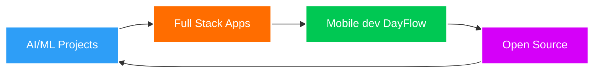

<div align="center">
  
</div>

<div align="center">
  
[](https://linkedin.com/in/abderrahmane-houri)
[](mailto:abderrahmane.houri@ensia.edu.dz)
[](https://github.com/Abderrahamane)
[](https://abderrahamane.github.io/Portfolio/)

</div>

---

## About Me

```python
class AbderrahmaneHouri:
    def __init__(self):
        self.name = "Abderrahmane Houri"
        self.role = "Full Stack AI Developer"
        self.education = "Computer Science Student @ ENSIA"
        self.location = "Algiers, Algeria 🇩🇿"
        self.interests = ["AI/ML", "Web Development", "Mobile Apps", "Cloud Computing"]
        
    def current_focus(self):
        return [
            "Building AI-powered applications",
            "Exploring Large Language Models",
            "Creating full-stack solutions",
            "Contributing to open source"
        ]
    
    def say_hi(self):
        print("Thanks for dropping by! Let's build something amazing together")

me = AbderrahmaneHouri()
me.say_hi()
```

 **Computer Science Student** passionate about leveraging AI and modern technologies to solve real-world problems. I specialize in building intelligent, scalable applications that bridge the gap between machine learning and practical user experiences.

 **Currently:** Diving deep into AI/ML, building full-stack applications, and exploring the latest in cloud technologies.

 **Learning:** Advanced AI architectures, MLOps, Microservices, and Cloud-Native development.

 **Fun fact:** I believe the best code is the code that makes a difference!

---

##  Tech Stack & Skills

###  AI & Machine Learning


###  Frontend Development


###  Backend Development


###  Mobile Development


###  Databases


###  Cloud & DevOps


### Tools & Platforms


---

## GitHub Statistics

<div align="center">
  


</div>

<div align="center">
  


</div>

---

## Featured Projects

<div align="center">

[](https://github.com/Abderrahamane/minibank)

</div>

### 🏦 MiniBank - Mobile Banking Application
A secure, feature-rich mobile banking app built with Flutter & Firebase featuring real-time transactions, multi-language support, and beautiful UI/UX.

-> it's now still under development

**Tech Stack:** Flutter • Firebase • Dart • Provider • Cloud Firestore


---

## 📈 Contribution Activity

<div align="center">
  


</div>

---

## What I'm Working On



-  Building AI-powered web applications
- Learning advanced ML techniques and cloud architecture
-  Looking to collaborate on innovative AI/ML projects
-  Ask me about: Python, React, Flutter, Machine Learning
-  Reach me at: **abderrahmane.houri@ensia.edu.dz**

---

## My Goals for 2026

- [ ] Master full-stack development
- [ ] Build production-ready AI applications
- [ ] Contribute to major open-source projects
- [ ] Launch a SaaS product
- [ ] Mentor aspiring developers

---

##  Latest Blog Posts

<!-- BLOG-POST-LIST:START -->
-  Building Intelligent Apps with LLMs
-  Flutter + Firebase: Production-Ready Mobile Apps
-  Machine Learning Best Practices
-  Cloud-Native Architecture Patterns
<!-- BLOG-POST-LIST:END -->

---

## Skills Breakdown

<div align="center">

| Category | Technologies                             | Proficiency |
|----------|------------------------------------------|-------------|
| **AI/ML** | Python, TensorFlow, PyTorch, Scikit-learn | ████████░░ 80% |
| **Frontend** | React, Next.js, TypeScript, Tailwind CSS | ████████░░ 85% |
| **Backend** | Node.js, Django, FastAPI, Express        | ███████░░░ 75% |
| **Mobile** | Flutter, React Native                    | ████████░░ 80% |
| **Database** | MongoDB, MySQL, Firebase                 | ███████░░░ 75% |
| **DevOps** | Docker, AWS, CI/CD                       | ██████░░░░ 65% |

</div>

---

## Let's Connect!

<div align="center">

I'm always excited to collaborate on innovative projects, especially in AI/ML and full-stack development. Whether you have an idea, need help with a project, or just want to chat about tech, feel free to reach out!

**Email:** [abderrahmane.houri@ensia.edu.dz](mailto:abderrahmane.houri@ensia.edu.dz)

**GitHub:** [@Abderrahamane](https://github.com/Abderrahamane)


</div>

---

<div align="center">

###  Quote of the Day


###  Fun Stats


</div>

---

<div align="center">

**💙 Show some love by starring my repositories!**

*"The only way to do great work is to love what you do." - Steve Jobs*

⭐️ From [Abderrahamane](https://github.com/Abderrahamane)

</div>
